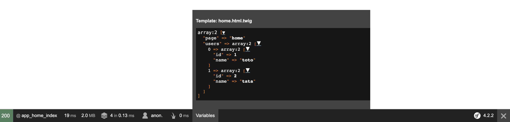

# TwigProfilerVariablesBundle

## Installation

The bundle is designed to work with Symfony 3.4 or 4.x. Older version are not supported.

Install the bundle via Composer:  
`composer require --dev hyoa/twig-profiler-variables-bundle`

Enable the bundle in your kernel:  

####Symfony 4.x
```yml
# config/packages/framework.yaml
framework:
    ...
    templating:
        engines: ['profiler_variables']
```

```php
// config/bundles.php
<?php

return [
    ...
    Hyoa\TwigProfilerVariablesBundle\TwigProfilerVariablesBundle::class => ['dev' => true]
];
```

####Symfony 3.4.x
```yml
# app/config/config_dev.yml
framework:
    ...
    templating:
        engines: ['profiler_variables']
```

```php
// app/AppKernel.php
<?php

    public function registerBundles()
    {
        ...
        if (in_array($this->getEnvironment(), ['dev', 'test'], true)) {
            ...
            if ('dev' === $this->getEnvironment()) {
                ...
                $bundles[] = new \Hyoa\TwigProfilerVariablesBundle\TwigProfilerVariablesBundle();
            }
        }

        return $bundles;
    }
```

## Example
```php
<?php


namespace App\Controller;

use Symfony\Bundle\FrameworkBundle\Controller\AbstractController;
use Symfony\Component\Routing\Annotation\Route;

class HomeController extends AbstractController
{
    /**
     * @Route("/")
     */
    public function indexAction()
    {
        return $this->render(
            'home.html.twig',
            [
                'page' => 'home',
                'users' => [
                   ['id' => 1, 'name' => 'toto'],
                   ['id' => 2, 'name' => 'tata'],
                ]
            ]
        );
    }
}
```



## Tests
The only test is an integration that assert the profiler received correctly the variables from the controller.
You can run it the following way: `vendor/bin/phpunit`
